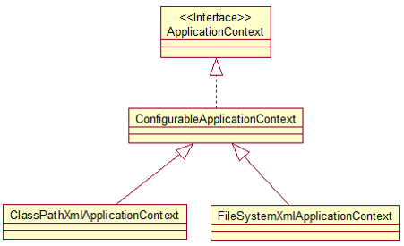

<!-- START doctoc generated TOC please keep comment here to allow auto update -->
<!-- DON'T EDIT THIS SECTION, INSTEAD RE-RUN doctoc TO UPDATE -->

- [Spring4学习](#spring4%E5%AD%A6%E4%B9%A0)
  - [一、配置Bean](#%E4%B8%80%E9%85%8D%E7%BD%AEbean)
    - [1、property注入属性](#1property%E6%B3%A8%E5%85%A5%E5%B1%9E%E6%80%A7)
    - [2、构造函数 constructor-arg 注入](#2%E6%9E%84%E9%80%A0%E5%87%BD%E6%95%B0-constructor-arg-%E6%B3%A8%E5%85%A5)
      - [（1）根据参数顺序注入](#1%E6%A0%B9%E6%8D%AE%E5%8F%82%E6%95%B0%E9%A1%BA%E5%BA%8F%E6%B3%A8%E5%85%A5)
      - [（2）CDATA 处理特殊字符](#2cdata-%E5%A4%84%E7%90%86%E7%89%B9%E6%AE%8A%E5%AD%97%E7%AC%A6)
      - [（3）根据参数类型注入](#3%E6%A0%B9%E6%8D%AE%E5%8F%82%E6%95%B0%E7%B1%BB%E5%9E%8B%E6%B3%A8%E5%85%A5)
    - [3、引用其他Bean](#3%E5%BC%95%E7%94%A8%E5%85%B6%E4%BB%96bean)
      - [（1）引用外部对象](#1%E5%BC%95%E7%94%A8%E5%A4%96%E9%83%A8%E5%AF%B9%E8%B1%A1)
      - [（2）引用内部对象](#2%E5%BC%95%E7%94%A8%E5%86%85%E9%83%A8%E5%AF%B9%E8%B1%A1)
      - [（3）构造函数注入其他对象](#3%E6%9E%84%E9%80%A0%E5%87%BD%E6%95%B0%E6%B3%A8%E5%85%A5%E5%85%B6%E4%BB%96%E5%AF%B9%E8%B1%A1)
      - [（4）null属性赋值](#4null%E5%B1%9E%E6%80%A7%E8%B5%8B%E5%80%BC)
    - [4、级联属性配置](#4%E7%BA%A7%E8%81%94%E5%B1%9E%E6%80%A7%E9%85%8D%E7%BD%AE)
    - [5、集合属性注入](#5%E9%9B%86%E5%90%88%E5%B1%9E%E6%80%A7%E6%B3%A8%E5%85%A5)
      - [（1）配置List集合](#1%E9%85%8D%E7%BD%AElist%E9%9B%86%E5%90%88)
      - [（2）配置Map集合](#2%E9%85%8D%E7%BD%AEmap%E9%9B%86%E5%90%88)
      - [（3）Properties 属性配置](#3properties-%E5%B1%9E%E6%80%A7%E9%85%8D%E7%BD%AE)
      - [（4）util schema 复用单例集合](#4util-schema-%E5%A4%8D%E7%94%A8%E5%8D%95%E4%BE%8B%E9%9B%86%E5%90%88)
      - [（5）p命名空间简化配置](#5p%E5%91%BD%E5%90%8D%E7%A9%BA%E9%97%B4%E7%AE%80%E5%8C%96%E9%85%8D%E7%BD%AE)
    - [6、自动装配](#6%E8%87%AA%E5%8A%A8%E8%A3%85%E9%85%8D)
    - [7、bean 之间的关系](#7bean-%E4%B9%8B%E9%97%B4%E7%9A%84%E5%85%B3%E7%B3%BB)
      - [（1）继承](#1%E7%BB%A7%E6%89%BF)
      - [（2）依赖](#2%E4%BE%9D%E8%B5%96)
    - [8、bean 的作用域](#8bean-%E7%9A%84%E4%BD%9C%E7%94%A8%E5%9F%9F)
    - [9、使用外部属性文件](#9%E4%BD%BF%E7%94%A8%E5%A4%96%E9%83%A8%E5%B1%9E%E6%80%A7%E6%96%87%E4%BB%B6)

<!-- END doctoc generated TOC please keep comment here to allow auto update -->

# Spring4学习

## 一、配置Bean

### 1、property注入属性

这里采用IEDA开发，首先建立一个Spring工程，然后在src下创建com.jack.spring.helloworld包。

编写HelloWorld.java文件，该文件内容如下：

```java
public class HelloWorld {

	private String user;
	
	public HelloWorld() {
		System.out.println("HelloWorld's constructor...");
	}
	
	public void setUser(String user) {
		System.out.println("setUser:" + user);
		this.user = user;
	}

	public void hello(){
		System.out.println("Hello: " + user);
	}
	
}
```

然后创建Main.java，该文件中执行main方法：

```java
public class Main {
	
	public static void main(String[] args) {
		
		HelloWorld helloWorld = new HelloWorld();
		helloWorld.setUser("Tom");
		helloWorld.hello();
	}
	
}

```

运行结果如下：

```
HelloWorld's constructor...
setUser:Tom
Hello: Tom
```

调用构造方法、设置属性值、打印属性值。

上面的方法是我们自己主动创建构建对象的，下面采用Spring的IOC容器来构建对象。

在前面工程的基础上创建一个spring 的beans.xml配置文件，这个可以使用IDEA主动创建，该beans.xml文件位于src目录下，与com目录同级，向该文件中添加：

```xml
<!-- 配置一个 bean
class: bean的全类名，通过反射的方式在IOC容器中建立Bean，所以哟啊求Bean中必须有无参的构造器
id: 标识容器中的bean，id 唯一-->
<bean id="helloWorld" class="com.jack.spring.helloworld.HelloWorld">
<!--为属性赋值-->
<property name="user" value="Jerry"></property>
</bean>
```

其中：

* **class**: bean的全类名，通过反射的方式在IOC容器中建立Bean，所以**Bean中必须有无参的构造器**
* **id**: 标识容器中的bean，id 唯一

<bean>的子标签下有<property>标签，里面的name指的是需要赋值的变量，value则为赋值。修改main函数，添加代码：

```java
//		1. 创建 Spring 的 IOC 容器
ApplicationContext ctx = new ClassPathXmlApplicationContext("beans.xml");
```

这里使用了 **ApplicationContext** 来获取一个IOC容器，ApplicationContext 的主要实现类：

* **ClassPathXmlApplicationContext**：从 **类路径下**加载配置文件

* **FileSystemXmlApplicationContext**：从**文件系统**中加载配置文件

下面是继承图：



**ConfigurableApplicationContext** 扩展于 **ApplicationContext**，新增加两个主要方法：**refresh()** 和 **close()**， 让 ApplicationContext 具有启动、刷新和关闭上下文的能力。

这一行运行结果如下：

```
HelloWorld's constructor...
setUser:Jerry
```

**ApplicationContext** **在初始化上下文时就实例化所有单例的** **Bean**。

继续完善代码：

```java
//		1. 创建 Spring 的 IOC 容器
ApplicationContext ctx = new ClassPathXmlApplicationContext("beans.xml");

//		2. 从 IOC 容器中获取 bean 的实例
HelloWorld helloWorld = (HelloWorld) ctx.getBean("helloWorld");
helloWorld.hello();
```

接下来通过IOC容器通过id获取一个HelloWorld对象，调用其方法。

当然，也可以通过该方法来获取一个HelloWorld对象：

```java
HelloWorld helloWorld1 = ctx.getBean(HelloWorld.class);
```

根据类型来获取 bean 的实例，要求在  IOC 容器中只有一个与之类型匹配的 bean, 若有多个则会抛出异常。

### 2、构造函数 constructor-arg 注入

#### （1）根据参数顺序注入

在之前工程的基础上继续添加一个Car类：

```java
public class Car {

	private String company;
	private String brand;

	private int maxSpeed;
	private float price;

	public Car(String company, String brand, float price) {
		super();
		this.company = company;
		this.brand = brand;
		this.price = price;
	}

	public Car(String company, String brand, int maxSpeed) {
		super();
		this.company = company;
		this.brand = brand;
		this.maxSpeed = maxSpeed;
	}

	public Car(String company, String brand, int maxSpeed, float price) {
		super();
		this.company = company;
		this.brand = brand;
		this.maxSpeed = maxSpeed;
		this.price = price;
	}

	@Override
	public String toString() {
		return "Car [company=" + company + ", brand=" + brand + ", maxSpeed="
				+ maxSpeed + ", price=" + price + "]";
	}
}
```

在其中定义了四个成员变量，并定义了多个构造函数，下面将探究如何通过构造函数注入变量。

在beans.xml中添加：

```xml
<bean id="car" class="com.jack.spring.helloworld.Car">
    <constructor-arg value="KUGA" index="0"></constructor-arg>
    <constructor-arg value="ChangAnFord" index="1"></constructor-arg>
    <constructor-arg value="250000" index="2"></constructor-arg>
</bean>
```

index标记了参数的顺序，value为参数的赋值，通过这种方法可以给 company、brand和maxSpeed三个变量赋值，修改main测试方法：

```java
ApplicationContext ctx = new ClassPathXmlApplicationContext("beans.xml");
Car car = (Car) ctx.getBean("car");
System.out.println(car);
```

输出如下：

```
Car [company=KUGA, brand=ChangAnFord, maxSpeed=250000, price=0.0]
```

#### （2）CDATA 处理特殊字符

如果字面值中包含特殊字符, 则可以使用 <![CDATA[]]> 来进行赋值，例如：

```xml
    <bean id="car" class="com.jack.spring.helloworld.Car">
        <constructor-arg value="KUGA" index="0"></constructor-arg>
        <constructor-arg index="1">
            <value><![CDATA[<ChangAnFord>]]></value>
        </constructor-arg>
        <constructor-arg value="250000" index="2"></constructor-arg>
    </bean>
```

ChangAnFord变成了<ChangAnFord>，输出结果如下：

```
Car [company=KUGA, brand=<ChangAnFord>, maxSpeed=250000, price=0.0]
```

#### （3）根据参数类型注入

当然也可以**根据参数的类型**来区分重载的构造器。修改beans.xml，添加一个bean：

```xml
    <bean id="car2" class="com.jack.spring.helloworld.Car">
        <constructor-arg value="KUGA" type="java.lang.String"></constructor-arg>
        <constructor-arg type="java.lang.String">
            <!-- 若字面值中包含特殊字符, 则可以使用 <![CDATA[]]> 来进行赋值，下面的值是 <ChangAnFord> -->
            <!--属性值可以使用value子节点来进行赋值-->
            <value><![CDATA[<ChangAnFord>]]></value>
        </constructor-arg>
        <constructor-arg value="24" type="float"></constructor-arg>
    </bean>
```

这次给price赋值，修改测试main方法：

```java
ApplicationContext ctx = new ClassPathXmlApplicationContext("beans.xml");
Car car2 = (Car) ctx.getBean("car2");
System.out.println(car2);
```

结果如下：

```
Car [company=KUGA, brand=<ChangAnFord>, maxSpeed=0, price=24.0]
```

### 3、引用其他Bean

试设想这样一种情况，现在有两个类，A类是B类的成员变量，这种情况下如何引用呢？

#### （1）引用外部对象

在先前的工作目录下新建一个类Person.java，内容如下：

```java
public class Person {
    private int age;
    private String name;
    private Car car;

    public int getAge() {
        return age;
    }

    public void setAge(int age) {
        this.age = age;
    }

    public String getName() {
        return name;
    }

    public void setName(String name) {
        this.name = name;
    }

    public Car getCar() {
        return car;
    }

    public void setCar(Car car) {
        this.car = car;
    }

    @Override
    public String toString() {
        return "Person{" +
                "age=" + age +
                ", name='" + name + '\'' +
                ", car=" + car +
                '}';
    }
}
```

该Person类中有三个成员变量 age，name和car，其中car是先前的Car对象。修改beans.xml，加入：

```xml
    <bean id="car2" class="com.jack.spring.helloworld.Car">
        <constructor-arg value="KUGA" type="java.lang.String"></constructor-arg>
        <constructor-arg type="java.lang.String">
            <!-- 若字面值中包含特殊字符, 则可以使用 <![CDATA[]]> 来进行赋值，下面的值是 <ChangAnFord> -->
            <!--属性值可以使用value子节点来进行赋值-->
            <value><![CDATA[<ChangAnFord>]]></value>
        </constructor-arg>
        <constructor-arg value="24" type="float"></constructor-arg>
    </bean>   

    <bean id="person" class="com.jack.spring.helloworld.Person">
        <property name="age" value="12"></property>
        <property name="name" value="jack"></property>
        <!--<property name="car" >-->
            <!--<ref bean="car2"/>-->
        <!--</property>-->
        <property name="car" ref="car2"></property>
    </bean>
```

这里通过使用<ref>标签或者 **ref** 属性来引用另一个对象。

修改main方法：

```java
ApplicationContext ctx = new ClassPathXmlApplicationContext("beans.xml");
Person person = (Person)ctx.getBean("person");
System.out.println(person);
```

输出结果如下：

```
Person{age=12, name='jack', car=Car [company=KUGA, brand=<ChangAnFord>, maxSpeed=0, price=24.0]}
```

#### （2）引用内部对象

前面的方法是引用了类的外部对象car2，这个外部对象car2任何变量都可以访问到的，如果想引用内部对象，也就是该person对象的内部创建的car对象，则需要修改beans.xml：

```xml
    <bean id="person" class="com.jack.spring.helloworld.Person">
        <property name="age" value="12"></property>
        <property name="name" value="jack"></property>
        <!--外部注入，引用类的外部对象-->
        <!--<property name="car" >-->
            <!--<ref bean="car2"/>-->
        <!--</property>-->
        <!--<property name="car" ref="car2"></property>-->
        <!--内部注入，相当于创建了一个类的局部私有变量，外部不可访问-->
        <property name="car">
            <bean class="com.jack.spring.helloworld.Car">
                <constructor-arg value="KUGA" index="0"></constructor-arg>
                <constructor-arg value="ChangAnFord" index="1"></constructor-arg>
                <constructor-arg value="250000" index="2"></constructor-arg>
            </bean>
        </property>
    </bean>
```

输出结果如下：

```
Person{age=12, name='jack', car=Car [company=KUGA, brand=ChangAnFord, maxSpeed=250000, price=0.0]}
```

#### （3）构造函数注入其他对象

前面对于Person对象的属性注入都是采用property的方式，这里也可以采用构造函数注入的方式。

修改Person类，加入一个无参和有参构造函数：

```java
    public Person() {
    }

    public Person(int age, String name, Car car) {
        this.age = age;
        this.name = name;
        this.car = car;
    }
```

在beans.xml中天机一个person2对象：

```xml
    <bean id="person2" class="com.jack.spring.helloworld.Person">
        <constructor-arg value="14" index="0"></constructor-arg>
        <constructor-arg value="jack" index="1"></constructor-arg>
        <constructor-arg ref="car"></constructor-arg>
    </bean>
```

修改main方法：

```java
ApplicationContext ctx = new ClassPathXmlApplicationContext("beans.xml");
Person person = (Person)ctx.getBean("person2");
System.out.println(person);
```

测试结果如下：

```
Person{age=14, name='jack', car=Car [company=KUGA, brand=ChangAnFord, maxSpeed=250000, price=0.0]}
```

#### （4）null属性赋值

当然，如果不想给某个属性赋值，可以使用专用的 **<null/>** 元素标签为 Bean 的字符串或其它对象类型的属性注入 null 值。例如：

```java
    <bean id="person2" class="com.jack.spring.helloworld.Person">
        <constructor-arg value="14" index="0"></constructor-arg>
        <constructor-arg value="jack" index="1"></constructor-arg>
        <constructor-arg><null/></constructor-arg>
    </bean>
```

打印如下：

```
Person{age=14, name='jack', car=null}
```

### 4、级联属性配置

和 Struts、Hiberante 等框架一样，**Spring** **支持级联属性的配置**，例如：

```xml
    <bean id="person2" class="com.jack.spring.helloworld.Person">
        <constructor-arg value="14" index="0"></constructor-arg>
        <constructor-arg value="jack" index="1"></constructor-arg>
        <constructor-arg ref="car"></constructor-arg>
        <property name="car.maxSpeed" value="250"></property>
        <!--<constructor-arg><null/></constructor-arg>-->
    </bean>
```

这里设置了：

```xml
<property name="car.maxSpeed" value="250"></property>
```

打印结果如下：

```
Person{age=14, name='jack', car=Car [company=KUGA, brand=ChangAnFord, maxSpeed=250, price=0.0]}
```

### 5、集合属性注入

Spring也支持集合属性注入。

在 Spring中可以通过一组内置的 xml 标签(例如: <list>, <set> 或 <map>) 来配置集合属性。

#### （1）配置List集合

配置 java.util.List 类型的属性, 需要指定 **<list>** 标签, 在标签里包含一些元素. 这些标签可以通过 **<value>** 指定简单的常量值, 通过 **<ref>** 指定对其他 Bean 的引用. 通过**<bean>** 指定内置 Bean 定义. 通过 <null/> 指定空元素. 甚至可以内嵌其他集合。

数组的定义和 List 一样, 都使用 <list>。

配置 java.util.Set 需要使用 <set> 标签, 定义元素的方法与 List 一样。

在com.jack.spring下新建一个包collections，创建一个Person类：

```java
import com.jack.spring.helloworld.Car;

import java.util.List;

public class Person {
    private int age;
    private String name;
    private List<Car> cars;

    public Person() {
    }

    public Person(int age, String name, List<Car> cars) {
        this.age = age;
        this.name = name;
        this.cars = cars;
    }

    public int getAge() {
        return age;
    }

    public void setAge(int age) {
        this.age = age;
    }

    public String getName() {
        return name;
    }

    public void setName(String name) {
        this.name = name;
    }

    public List<Car> getCars() {
        return cars;
    }

    public void setCars(List<Car> cars) {
        this.cars = cars;
    }

    @Override
    public String toString() {
        return "Person{" +
                "age=" + age +
                ", name='" + name + '\'' +
                ", cars=" + cars +
                '}';
    }
}
```

这里引用了hello包下的Car类。该Person类中定义了一个Car列表，接下来就要在beans.xml给属性注入值。修改beans.xml，增加：

```xml
    <bean id="person3" class="com.jack.spring.collections.Person">
        <property name="name" value="jack"></property>
        <property name="age" value="23"></property>
        <property name="cars">
            <list>
                <ref bean="car"></ref>
                <ref bean="car2"></ref>
                <bean class="com.jack.spring.helloworld.Car">
                    <constructor-arg value="KUGA" index="0"></constructor-arg>
                    <constructor-arg value="ChangAnFord" index="1"></constructor-arg>
                    <constructor-arg value="260000" index="2"></constructor-arg>
                </bean>
            </list>
        </property>
    </bean>
```

在collections目录下创建测试Main方法，加入：

```java
public class Main {
    public static void main(String[] args) {
        ApplicationContext apx = new ClassPathXmlApplicationContext("beans.xml");
        Person person = (Person)apx.getBean("person3");
        System.out.println(person);
    }
}
```

输出结果如下：

```
Person{age=23, name='jack', cars=[Car [company=KUGA, brand=ChangAnFord, maxSpeed=250, price=0.0], Car [company=KUGA, brand=<ChangAnFord>, maxSpeed=0, price=24.0], Car [company=KUGA, brand=ChangAnFord, maxSpeed=260000, price=0.0]]}
```

#### （2）配置Map集合

Java.util.Map 通过 **<map>** 标签定义, <map> 标签里可以使用多个 **<entry>** 作为子标签. 每个条目包含一个键和一个值。因为键和值的类型没有限制, 所以可以自由地为它们指定 **<value>, <ref>, <bean>** 或 **<null>** 元素。

可以将 Map 的键和值作为 <entry> 的属性定义: 简单常量使用 key 和 value 来定义; Bean 引用通过 key-ref 和 value-ref 属性定义。

在collections包下新建一个类NewPerson：

```java
import com.jack.spring.helloworld.Car;

import java.util.Map;

public class NewPerson {
    private int age;
    private String name;
    private Map<String, Car> cars;

    public NewPerson() {
    }

    public NewPerson(int age, String name, Map<String, Car> cars) {
        this.age = age;
        this.name = name;
        this.cars = cars;
    }

    public int getAge() {
        return age;
    }

    public void setAge(int age) {
        this.age = age;
    }

    public String getName() {
        return name;
    }

    public void setName(String name) {
        this.name = name;
    }

    public Map<String, Car> getCars() {
        return cars;
    }

    public void setCars(Map<String, Car> cars) {
        this.cars = cars;
    }

    @Override
    public String toString() {
        return "NewPerson{" +
                "age=" + age +
                ", name='" + name + '\'' +
                ", cars=" + cars +
                '}';
    }
}

```

修改beans.xml，添加：

```xml
    <bean id="person4" class="com.jack.spring.collections.NewPerson">
        <property name="age" value="25"></property>
        <property name="name" value="mark"></property>
        <property name="cars">
            <map>
                <entry key="no1" value-ref="car"></entry>
                <entry key="no2" value-ref="car2"></entry>
            </map>
        </property>
    </bean>
```

修改main测试函数：

```java
ApplicationContext apx = new ClassPathXmlApplicationContext("beans.xml");
NewPerson person = (NewPerson)apx.getBean("person4");
System.out.println(person);
```

输出结果如下：

```
NewPerson{age=25, name='mark', cars={no1=Car [company=KUGA, brand=ChangAnFord, maxSpeed=250, price=0.0], no2=Car [company=KUGA, brand=<ChangAnFord>, maxSpeed=0, price=24.0]}}
```

#### （3）Properties 属性配置

有时需要为一些配置属性进行复制，可以使用 **<props>** 定义 java.util.Properties, 该标签使用多个 **<prop>** 作为子标签. 每个 **<prop>** 标签必须定义 **key** 属性。

在collections包下新建一个类DataSoruce：

```java
import java.util.Properties;

public class DataSource {
    private Properties properties;

    public Properties getProperties() {
        return properties;
    }

    public void setProperties(Properties properties) {
        this.properties = properties;
    }

    @Override
    public String toString() {
        return "DataSource{" +
                "properties=" + properties +
                '}';
    }
}

```

修改beans.xml文件，添加：

```xml
    <bean id="dataSource" class="com.jack.spring.collections.DataSource">
        <property name="properties">
            <props>
                <prop key="user">root</prop>
                <prop key="password">123</prop>
                <prop key="jdbcUrl">jdbc:mysql:///test</prop>
                <prop key="driverClass">com.mysql.jdbc.Driver</prop>
            </props>
        </property>
    </bean>
```

修改main测试方法：

```java
ApplicationContext apx = new ClassPathXmlApplicationContext("beans.xml");
DataSource dataSource = (DataSource)apx.getBean("dataSource");
System.out.println(dataSource);
```

测试结果如下：

```
DataSource{properties={driverClass=com.mysql.jdbc.Driver, user=root, password=123, jdbcUrl=jdbc:mysql:///test}}
```

#### （4）util schema 复用单例集合

使用基本的集合标签定义集合时, 不能将集合作为独立的 Bean 定义,导致其他 Bean 无法引用该集合,所以无法在不同 Bean之间共享集合。

先前配置一个list的做法是这样的：

```xml
    <bean id="person3" class="com.jack.spring.collections.Person">
        <property name="name" value="jack"></property>
        <property name="age" value="23"></property>
        <property name="cars">
            <list>
                <ref bean="car"></ref>
                <ref bean="car2"></ref>
                <bean class="com.jack.spring.helloworld.Car">
                    <constructor-arg value="KUGA" index="0"></constructor-arg>
                    <constructor-arg value="ChangAnFord" index="1"></constructor-arg>
                    <constructor-arg value="260000" index="2"></constructor-arg>
                </bean>
            </list>
        </property>
    </bean>
```

这样做有个缺点，就是配置的list只能在person3中使用，定义其他person时也要重新去设置这个list，这块代码不能被复用，所以可以使用util schema 里的集合标签定义独立的集合 Bean。需要注意的是, 必须在 <beans> 根元素里添加 util schema 定义。

修改beans.xml，加入：

```xml
    <!--配置单例的集合bean，以提供多个bean进行引用，这里需要导入util命名空间-->
    <util:list id="cars">
        <ref bean="car"></ref>
        <ref bean="car2"></ref>
    </util:list>

    <bean id="person5" class="com.jack.spring.collections.Person">
        <property name="name" value="jackster"></property>
        <property name="age" value="25"></property>
        <property name="cars" ref="cars"></property>
    </bean>
```

这里通过util命名空间导入了一个list对象，然后定义了一个person5对象，该对象的cars list集合引用了上面的util:list定义的**单例**对象，该对象是单例的。

接下来修改main测试方法：

```java
ApplicationContext apx = new ClassPathXmlApplicationContext("beans.xml");
Person person = (Person)apx.getBean("person5");
System.out.println(person);
```

测试结果如下：

```
Person{age=25, name='jackster', cars=[Car [company=KUGA, brand=ChangAnFord, maxSpeed=250, price=0.0], Car [company=KUGA, brand=<ChangAnFord>, maxSpeed=0, price=24.0]]}
```

#### （5）p命名空间简化配置

为了简化 XML 文件的配置，越来越多的 XML 文件采用属性而非子元素配置信息。Spring 从 2.5 版本开始引入了一个新的 p 命名空间，可以通过 <bean> 元素属性的方式配置 Bean 的属性。使用 p 命名空间后，基于 XML 的配置方式将进一步简化。

修改beans.xml，添加：

```xml
<bean id="person6" class="com.jack.spring.collections.Person" p:age="35" p:name="marry" p:cars-ref="cars"></bean>
```

修改main测试函数：

```java
ApplicationContext apx = new ClassPathXmlApplicationContext("beans.xml");
Person person = (Person)apx.getBean("person6");
System.out.println(person);
```

效果如下：

```
Person{age=35, name='marry', cars=[Car [company=KUGA, brand=ChangAnFord, maxSpeed=250, price=0.0], Car [company=KUGA, brand=<ChangAnFord>, maxSpeed=0, price=24.0]]}
```

<bean> 标签中采用p命名空间为bean赋值，需要先导入p命名空间，相对于传统的配置方式更加简洁。

### 6、自动装配

* Spring IOC 容器可以自动装配 Bean。需要做的仅仅是在<bean>的 autowire 属性里指定自动装配的模式。

* byType(根据类型自动装配)：若 IOC 容器中有多个与目标 Bean 类型一致的 Bean。在这种情况下，Spring 将无法判定哪个 Bean 最合适该属性, 所以不能执行自动装配。

* byName(根据名称自动装配)：必须将目标 Bean 的名称和属性名设置的完全相同。

* constructor(通过构造器自动装配)：当 Bean 中存在多个构造器时, 此种自动装配方式将会很复杂。**不推荐使用**。

在com.jack.spring目录下创建一个包autowire，创建三个类Car、Address和Person：

```java
public class Address {
    private String city;
    private String street;

    public String getCity() {
        return city;
    }

    public void setCity(String city) {
        this.city = city;
    }

    public String getStreet() {
        return street;
    }

    public void setStreet(String street) {
        this.street = street;
    }

    @Override
    public String toString() {
        return "Address{" +
                "city='" + city + '\'' +
                ", street='" + street + '\'' +
                '}';
    }
}

```

```java
public class Car {

    private String brand;
    private double price;

    public String getBrand() {
        return brand;
    }

    public void setBrand(String brand) {
        this.brand = brand;
    }

    public double getPrice() {
        return price;
    }

    public void setPrice(double price) {
        this.price = price;
    }

    @Override
    public String toString() {
        return "Car{" +
                "brand='" + brand + '\'' +
                ", price=" + price +
                '}';
    }
}

```

```java
public class Person {
    private String name;
    private Address address;
    private Car car;

    public String getName() {
        return name;
    }

    public void setName(String name) {
        this.name = name;
    }

    public Address getAddress() {
        return address;
    }

    public void setAddress(Address address) {
        this.address = address;
    }

    public Car getCar() {
        return car;
    }

    public void setCar(Car car) {
        this.car = car;
    }

    @Override
    public String toString() {
        return "Person{" +
                "name='" + name + '\'' +
                ", address=" + address +
                ", car=" + car +
                '}';
    }
}

```

创建spring xml配置文件beans-autowire.xml，添加内容：

```xml
    <bean id="address" class="com.jack.spring.autowire.Address" p:city="BeiJing" p:street="HuiLongGuan"></bean>
    <bean id="car" class="com.jack.spring.autowire.Car" p:brand="Audi" p:price="300000"></bean>
    <bean id="person" class="com.jack.spring.autowire.Person" p:name="Tom" p:address-ref="address" p:car-ref="car"></bean>
```

编写main测试方法：

```java
public class Main {
    public static void main(String[] args) {
        ApplicationContext ctx = new ClassPathXmlApplicationContext("beans-autowire.xml");
        Person person = (Person)ctx.getBean("person");
        System.out.println(person);
    }
}
```

测试结果如下：

```
Person{name='Tom', address=Address{city='BeiJing', street='HuiLongGuan'}, car=Car{brand='Audi', price=300000.0}}
```

前面的方法还是使用了手动装配的方式，下面将采用autiwire自动装配方式。

```xml
<bean id="person" class="com.jack.spring.autowire.Person" p:name="Tom" autowire="byName"></bean>
```

或者

```xml
<bean id="person" class="com.jack.spring.autowire.Person" p:name="Tom" autowire="byType"></bean>
```

效果和前面一样。

但是还是有区别：

* byName 根据bean的名字和当前bean的setter风格的属性进行自动匹配，如果有匹配的则进行自动装配，如果没有匹配的则不匹配。
* byType 根据beand的类型和当前bean的属性类型进行自动装配，如果IOC容器中存在一个以上该类型bean，抛出异常。

### 7、bean 之间的关系

bean之间有继承和依赖两种关系。

#### （1）继承

* Spring 允许继承 bean 的配置, 被继承的 bean 称为父 bean；继承这个父 Bean 的 Bean 称为子 Bean
* 子 Bean 从父 Bean 中继承配置, 包括 Bean 的属性配置
* 子 Bean 也可以覆盖从父 Bean 继承过来的配置

创建一个新的spring xml配置文件beans-relation.xml，添加内容：

```xml
    <bean id="address1" class="com.jack.spring.autowire.Address" p:city="BeiJing" p:street="HuiLongGuan1"></bean>
    <bean id="address2" class="com.jack.spring.autowire.Address" p:city="BeiJing" p:street="HuiLongGuan2"></bean>
```

在com.jack.spring下创建relation包，创建测试Main类，添加内容：

```java
public class Main {
    public static void main(String[] args) {
        ApplicationContext ctx = new ClassPathXmlApplicationContext("beans-relation.xml");
        Address address = (Address)ctx.getBean("address1");
        System.out.println(address);

        address = (Address)ctx.getBean("address2");
        System.out.println(address);
    }
}
```

打印输出如下：

```
Address{city='BeiJing', street='HuiLongGuan1'}
Address{city='BeiJing', street='HuiLongGuan2'}
```

接下来修改配置文件：

```xml
    <bean id="address1" class="com.jack.spring.autowire.Address" p:city="BeiJing" p:street="HuiLongGuan1"></bean>
    <bean id="address2" parent="address1" p:street="HuiLongGuan2"></bean>
```

在address2中采用parent的方式继承address1的属性，也能达到和之前相同的测试结果。

父 Bean 可以作为**配置模板**, 也可以作为 Bean 实例. 若只想把父 Bean 作为模板, 可以设置 <bean> 的abstract 属性为 true, 这样 Spring 将不会实例化这个 Bean。

下面继续修改配置文件：

```xml
 <bean id="address1" class="com.jack.spring.autowire.Address" p:city="BeiJing" p:street="HuiLongGuan1" abstract="true"></bean>
```

设置abstract属性为true，运行测试程序，结果如下：

```java
Exception in thread "main" org.springframework.beans.factory.BeanIsAbstractException: Error creating bean with name 'address1': Bean definition is abstract
	at org.springframework.beans.factory.support.AbstractBeanFactory.checkMergedBeanDefinition(AbstractBeanFactory.java:1412)
	at org.springframework.beans.factory.support.AbstractBeanFactory.doGetBean(AbstractBeanFactory.java:298)
	at org.springframework.beans.factory.support.AbstractBeanFactory.getBean(AbstractBeanFactory.java:202)
	at org.springframework.context.support.AbstractApplicationContext.getBean(AbstractApplicationContext.java:1108)
	at com.jack.spring.relation.Main.main(Main.java:11)
```

直接抛出异常。设置为abstract=true的bean无法被IOC容器实例化，可以不指定class类型。

并不是 <bean> 元素里的所有属性都会被继承.。比如：autowire，abstract 等。也可以忽略父 Bean 的 class 属性，让子 Bean 指定自己的类，而共享相同的属性配置。但此时 abstract 必须设为 true。

#### （2）依赖

Spring 允许用户通过 depends-on 属性设定 Bean 前置依赖的Bean，前置依赖的 Bean 会在本 Bean 实例化之前创建好。如果前置依赖于多个 Bean，则可以通过逗号，空格或的方式配置 Bean 的名称。

接下来修改配置xml文件，添加：

```xml
    <bean id="car" class="com.jack.spring.autowire.Car" p:brand="Audi" p:price="400000"></bean>
    <bean id="person" class="com.jack.spring.autowire.Person" p:name="Tom" p:address="addressx" depends-on="car"></bean>
```

person依赖car。修改main测试方法：

```java
ApplicationContext ctx = new ClassPathXmlApplicationContext("beans-relation.xml");
Person person = (Person)ctx.getBean("person");
System.out.println(person);
```

测试结果如下：

```
Person{name='Tom', address=Address{city='BeiJing', street='HuiLongGuan2'}, car=null}
```

### 8、bean 的作用域

在 Spring 中, 可以在 <bean> 元素的 scope 属性里设置 Bean 的作用域。

默认情况下, Spring 只为每个在 IOC 容器里声明的 Bean 创建唯一一个实例, 整个 IOC 容器范围内都能共享该实例。所有后续的 getBean() 调用和 Bean 引用都将返回这个唯一的 Bean 实例。该作用域被称为 singleton, 它是所有 Bean 的默认作用域。

创建配置文件beans-scope.xml，添加：

```xml
    <bean id="car" class="com.jack.spring.autowire.Car">
        <property name="brand" value="BWM"></property>
        <property name="price" value="6666"></property>
    </bean>
```

在com.jack.spring下创建包scope，添加Main测试类：

```java
public class Main {
    public static void main(String[] args) {
        ApplicationContext ctx = new ClassPathXmlApplicationContext("beans-scope.xml");
        Car car = (Car)ctx.getBean("car");
        Car car2 = (Car)ctx.getBean("car");

        System.out.println(car == car2);
    }
}
```

测试结果是 **true**，默认情况下IOC容器创建的实例是单例 singleton模式。

接下来修改xml文件：

```xml
    <bean id="car" class="com.jack.spring.autowire.Car" scope="prototype">
        <property name="brand" value="BWM"></property>
        <property name="price" value="6666"></property>
    </bean>
```

指定该bean对象创建时都是采用 prototype 原型，指定后测试结果是 **false**。

### 9、使用外部属性文件

在配置文件里配置 Bean 时, 有时需要在 Bean 的配置里混入系统部署的细节信息(例如: 文件路径, 数据源配置信息等)，而这些部署细节实际上需要和 Bean 配置相分离。
Spring 提供了一个 PropertyPlaceholderConfigurer 的 BeanFactory 后置处理器, 这个处理器允许用户将 Bean 配置的部分内容外移到属性文件中. 可以在 Bean 配置文件里使用形式为 ${var} 的变量, PropertyPlaceholderConfigurer 从属性文件里加载属性, 并使用这些属性来替换变量。
Spring 还允许在属性文件中使用 ${propName}，以实现属性之间的相互引用。

在src目录下创建一个配置文件 db.properties，文件内容如下：

```
user=root
password=1230
driverClass=com.mysql.jdbc.Driver
jdbcUrl=jdbc:mysql:///test
```

在com.jack.spring目录下创建一个包preperty，添加DataSource类：

```java
package com.jack.spring.preperty;

public class DataSource {
    private String user;
    private String password;
    private String driverClass;
    private String jdbcUrl;

    public String getUser() {
        return user;
    }

    public void setUser(String user) {
        this.user = user;
    }

    public String getPassword() {
        return password;
    }

    public void setPassword(String password) {
        this.password = password;
    }

    public String getDriverClass() {
        return driverClass;
    }

    public void setDriverClass(String driverClass) {
        this.driverClass = driverClass;
    }

    public String getJdbcUrl() {
        return jdbcUrl;
    }

    public void setJdbcUrl(String jdbcUrl) {
        this.jdbcUrl = jdbcUrl;
    }

    @Override
    public String toString() {
        return "DataSource{" +
                "user='" + user + '\'' +
                ", password='" + password + '\'' +
                ", driverClass='" + driverClass + '\'' +
                ", jdbcUrl='" + jdbcUrl + '\'' +
                '}';
    }
}
```

在src文件下创建一个spring 配置文件 beans-properties.xml：

```xml
<?xml version="1.0" encoding="UTF-8"?>
<beans xmlns="http://www.springframework.org/schema/beans"
       xmlns:xsi="http://www.w3.org/2001/XMLSchema-instance"
       xmlns:context="http://www.springframework.org/schema/context"
       xsi:schemaLocation="http://www.springframework.org/schema/beans http://www.springframework.org/schema/beans/spring-beans.xsd http://www.springframework.org/schema/context https://www.springframework.org/schema/context/spring-context.xsd">

    <context:property-placeholder location="classpath:db.properties"></context:property-placeholder>

    <bean id="dataSource" class="com.jack.spring.preperty.DataSource">
        <property name="user" value="${user}"></property>
        <property name="password" value="${password}"></property>
        <property name="driverClass" value="${driverClass}"></property>
        <property name="jdbcUrl" value="${jdbcUrl}"></property>
    </bean>
</beans>
```

其中 context:property-placeholder 标签制定了需要读取的classpath下的db.properties配置文件。然后定义了一个dataSource bean，通过${}方式注入属性值。

接下来创建一个Main测试类：

```java
public class Main {
    public static void main(String[] args) {
        ApplicationContext ctx = new ClassPathXmlApplicationContext("beans-properties.xml");
        DataSource dataSource = (DataSource)ctx.getBean("dataSource");
        System.out.println(dataSource);
    }
}
```

输出结果如下：

```
DataSource{user='root', password='1230', driverClass='com.mysql.jdbc.Driver', jdbcUrl='jdbc:mysql:///test'}
```

